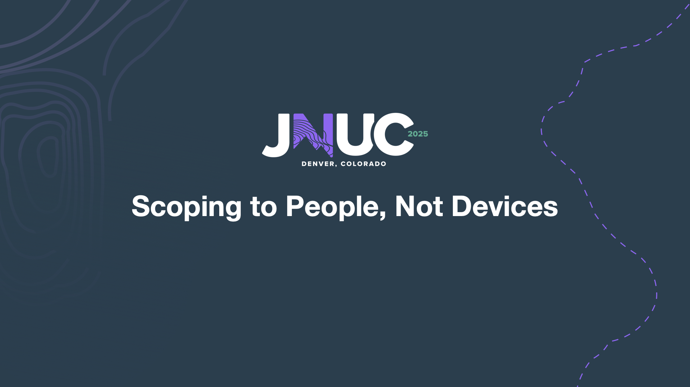

# JNUC-2025-Scoping to People, Not Devices

This repository contains resources and information related to the JNUC 2025 session titled "Scoping To Users". The session focuses on strategies and best practices for effectively scoping projects and tasks to meet user needs and expectations.

In this repository,
you will find the sample script used in the presentation to leverage the Jamf Pro API and Microsoft Graph API to scope devices based on Entra ID groups.

**Files:**
- `main.py` \- The main script that demonstrates how to scope devices to users using the Jamf Pro API and Microsoft Graph API.
- `microsoft_group_members.py` \- A python script that uses the msal module to get group members from Entra ID.
- `jamf_session.py` \- A simple function to create a session with Jamf Pro server using the requests module to be reused in other scripts.
- `jamf_pro_auth_token.py` \- A python script that uses the requests module to get an auth token from Jamf Pro.
- `jamf_pro_devices.py` \- Script to get all mobile devices assigned to a specific user in Jamf Pro.
- `jamf_pro_computers.py` \- Script to get all computers assigned to a specific user in Jamf Pro.
- `jamf_pro_mobile_groups.py` \- Script that checks for the existence of a mobile device group in Jamf Pro and creates it if it doesn't exist. Adds or removes devices from the group based on the provided list of device IDs.
- `jamf_pro_computer_groups.py` \- Script that checks for the existence of a computer group in Jamf Pro and creates it if it doesn't exist. Adds or removes computers from the group based on the provided list of computer IDs.